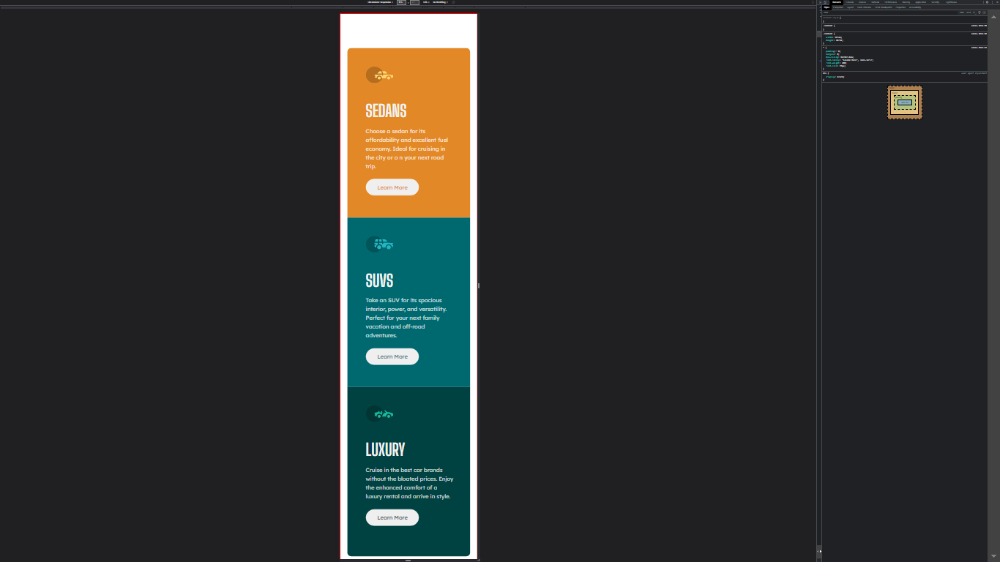
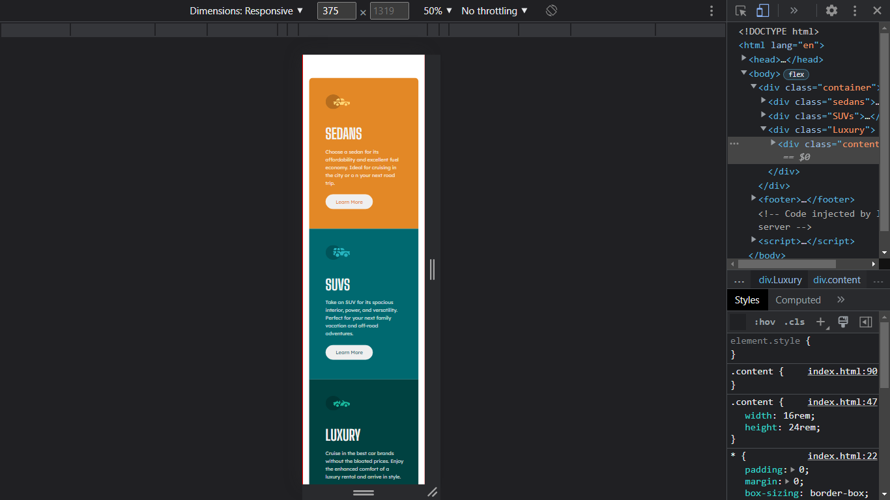
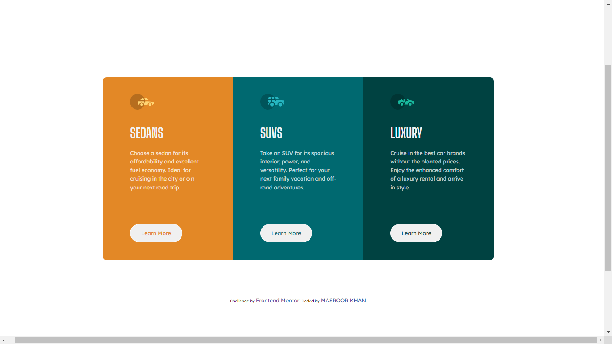
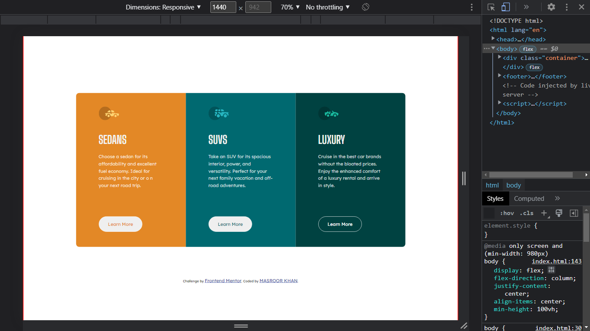

# Frontend Mentor - 3-column preview card component solution

This is a solution to the [3-column preview card component challenge on Frontend Mentor](https://www.frontendmentor.io/challenges/3column-preview-card-component-pH92eAR2-). Frontend Mentor challenges help you improve your coding skills by building realistic projects. 

## Table of contents

- [Overview](#overview)
  - [The challenge](#the-challenge)
  - [Screenshot](#screenshot)
  - [Links](#links)
- [My process](#my-process)
  - [Built with](#built-with)
  - [What I learned](#what-i-learned)
  - [Continued development](#continued-development)
  - [Useful resources](#useful-resources)
- [Author](#author)

## Overview

### The challenge

Users should be able to:

- View the optimal layout depending on their device's screen size
- See hover states for interactive elements

### Screenshot

Mobile View:

Desktop View:

### Links

- Solution URL: [Solution URL](https://github.com/EduCreative/FrontendMentor-3-column-preview-card.git)
- Live Site URL: [Live site URL](https://educreative.github.io/FrontendMentor-3-column-preview-card/)

## My process

### Built with

- HTML5
- CSS3
- Flexbox
- Mobile-first workflow

### What I learned

A really very good practice to switch from mobile to desktop (I have to add a few divs)

### Continued development

I need to design more of these challenges to get comfortable different types of designs.

### Useful resources

- [W3School](https://www.W3school.com) - This helped me for recalling syntax of different CSS statements.

## Author

- Website - [Masroor Khan ](https://educreative.github.io/)
- Frontend Mentor - [@EduCreative](https://www.frontendmentor.io/profile/EduCreative)
- Twitter - [@CreativeWork7](https://www.twitter.com/Creativework7)
